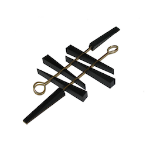

# pianotoner

A native iOS tone generator for tuning stringed instruments.
It was born as a piano tuning assistant, so it's name ended up being a contraction of piano tone/tuner...

## OVERVIEW

This is a native iOS app, written in Swift and Objective C.

It uses the AudioKit 4.4 framework a copy of which is included into the repository for easy testing and running.

It supports natively the iPhone and the iPad idioms.

It was retired from the App Store around 2018. The development has been paused since a while. It may be resumed one day.

Minimum iOS supported:
- iOS 10+

## CONTACT

If you have any questions or ideas you can contact me via GitHub Pages (https://lucaji.github.io), or via lucaji  ]at[  mail.ru.

## LICENSE

Starting from March 2021, I could find enough time to clean up and release the full source of the project under a GPL3 (or later) license. A full copy of it is included in the repository.

    PianoToneriOS - piano tone generator
    Copyright (C) 2017-2021  Luca Cipressi lucaji()mail.ru

    This program is free software: you can redistribute it and/or modify
    it under the terms of the GNU General Public License as published by
    the Free Software Foundation, either version 3 of the License, or
    any later version.

    This program is distributed in the hope that it will be useful,
    but WITHOUT ANY WARRANTY; without even the implied warranty of
    MERCHANTABILITY or FITNESS FOR A PARTICULAR PURPOSE.  See the
    GNU General Public License for more details.

    You should have received a copy of the GNU General Public License
    along with this program.  If not, see <https://www.gnu.org/licenses/>
    

## DISCLAIMER

This is an archived project going back to 2018 and since then not being maintained at the time of writing.

